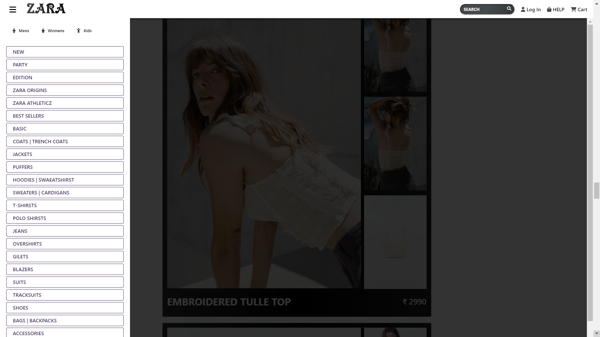
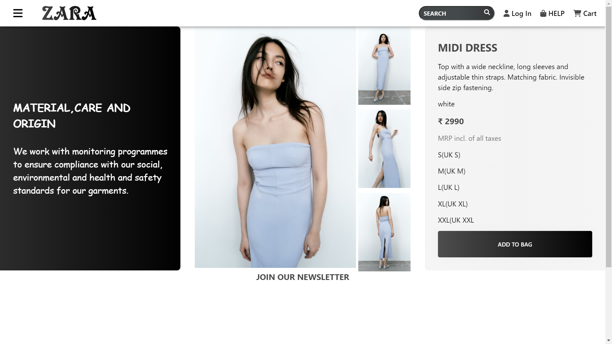
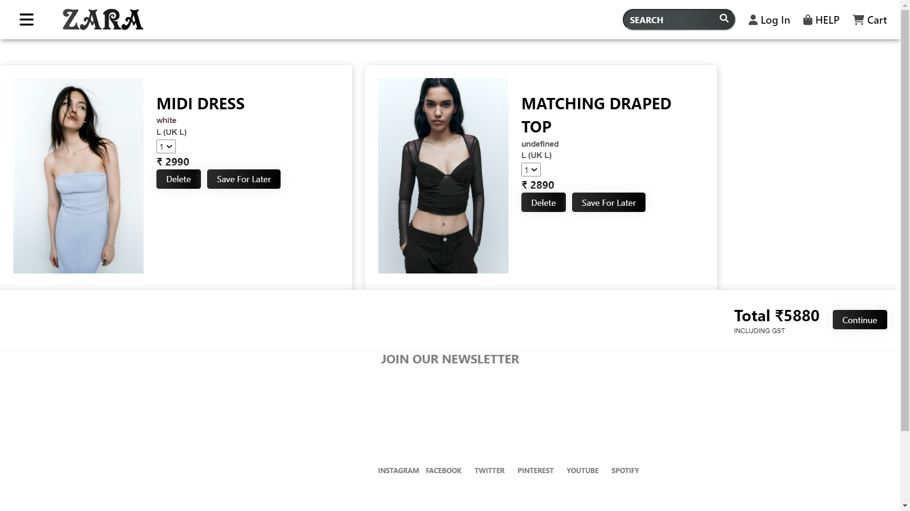
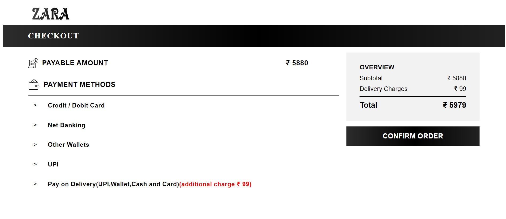

# Beneficial Jelly E-Commerce Website

 Zara is one of the world's largest international fashion companies . It belongs to Inditex, the world's biggest fashion group. Zara is a Spanish clothing retailer based in Galicia, Spain. Founded by Amancio Ortega in 1975, it is the flagship chain store of the Inditex group, the world's largest apparel retailer.

## Demo

Check out the live demo of the website [here](https://jimmy-sharma.github.io/beneficial-jelly-4258/).

## Features

- Homepage showcasing featured products and categories
- Product listing pages with search and filtering options
- Product details page with descriptions, pricing, and add-to-cart functionality
- Shopping cart functionality to add and remove items
- Checkout page with billing and shipping information
- Order confirmation page with an order summary

## Technologies Used

- HTML
- CSS
- JavaScript

## Getting Started

To run this project locally, follow these steps:

1. Clone the repository:

   ```bash
   git clone https://github.com/jimmy-sharma/beneficial-jelly-4258.git


## Page Description

- <strong>Homepage</strong>


- <strong>Product Page</strong>



- <strong>ProductDetails Page</strong>



- <strong>Cart Page</strong>



- <strong>Payment Page</strong>



